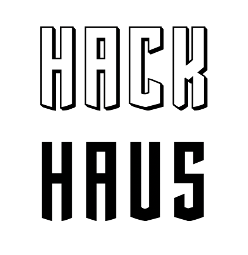

<!-- Main -->

<!-- One -->
<section id="one">
	

		<header class="major">
			<h1>{{ page.title }}</h1>
		</header>

<!-- Content -->

<h2 id="content">{{ page.description }}</h2>

    HackHaus was the culmination of desires to bring together Chicago around common causes that afffect our lives in common ways. For a long time, the Midwest has been considered "flyover" states, as most visitors to the United States tend to visit coast cities. Despite this tug between Big Finance and Crazy Dreamers stood the broad shoulders of Chicagoans, thirsty for businesses the likes of Sears, McDonald's, and Sear's &amp; Roebuck.

    Officially opening its doors in October 2019, HackHaus is home of several organizations with our first major member being <a href="https://weteachblockchain.org" alt="Blockchain Institute">Blockchain Institute</a>. By having education as a major component of the space, we are able to host training classes for blockchains and decentralization. These capabilities open up new avenues for fulfilling their non-profit mission.

    Interested in learning more or <a href="/how.html">joining us</a>?

</section>

