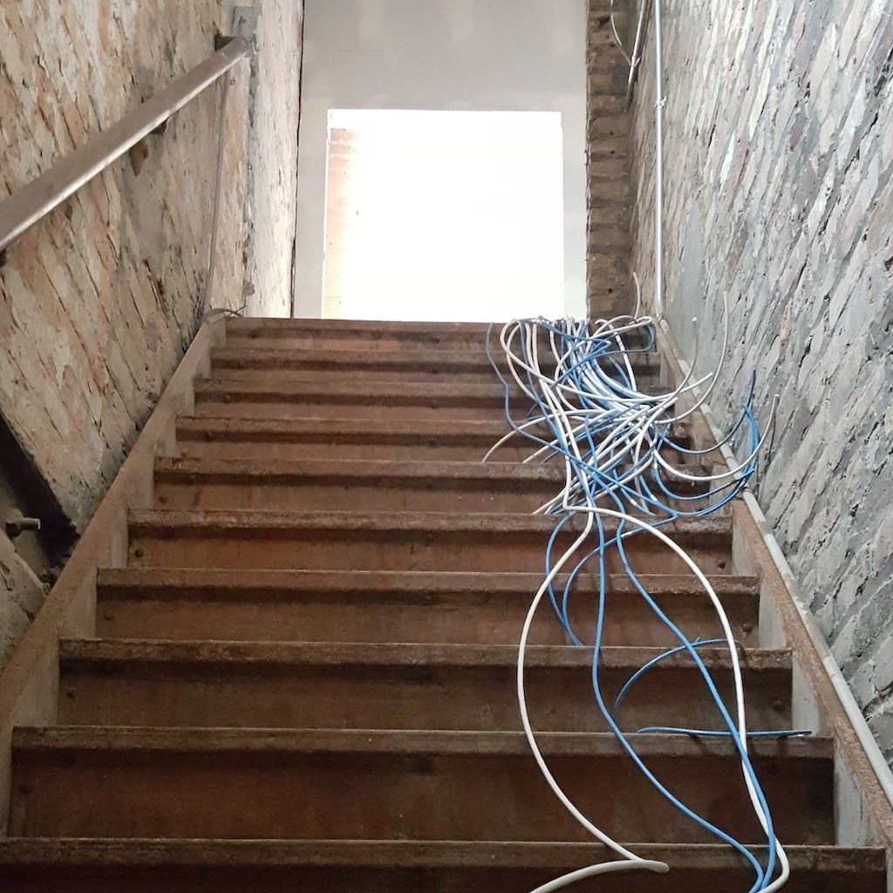
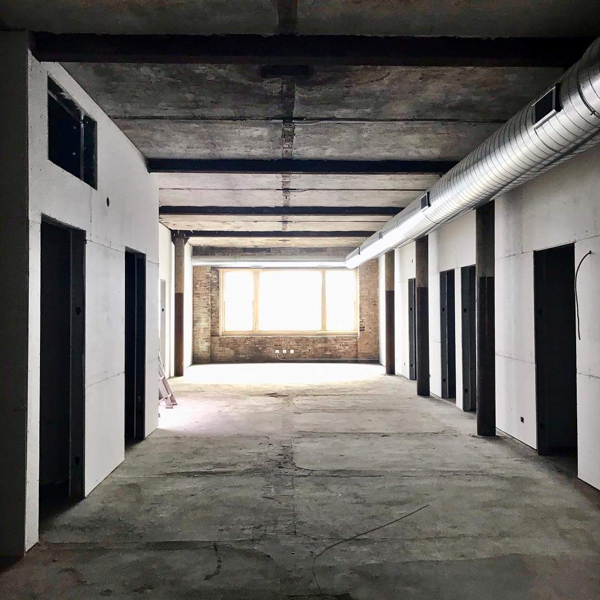
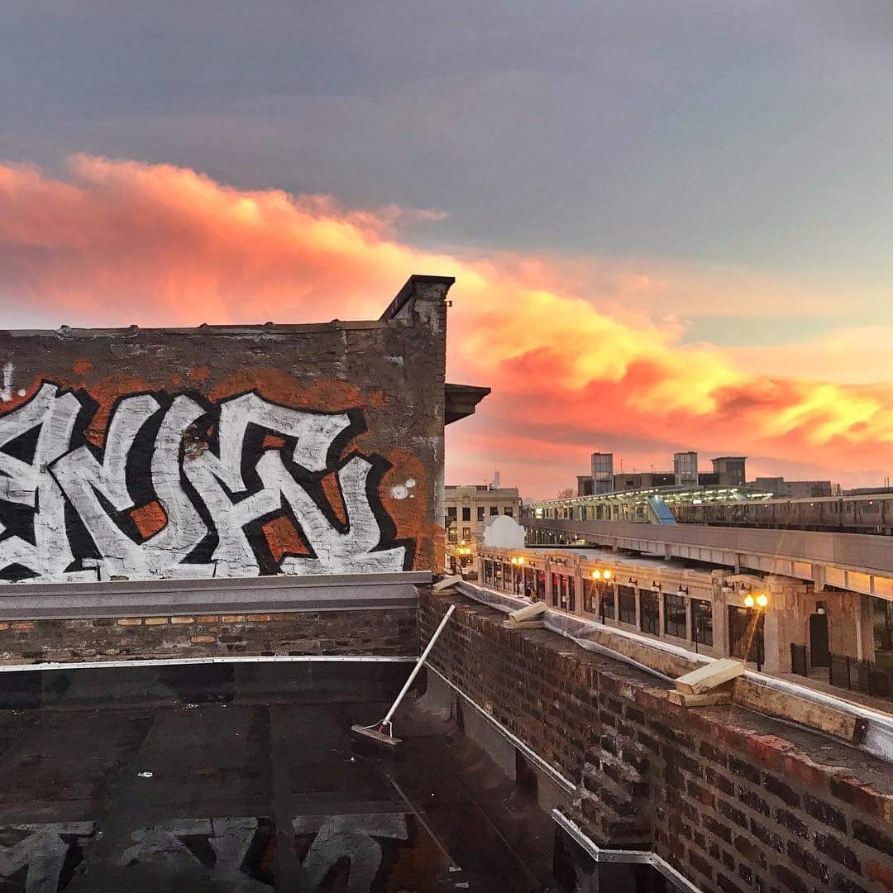

<!-- Main -->

<!-- One -->
<section id="one">
    

        <header class="major">
            <h2>We are a Community</h2>
        </header>
        
First and foremost, we are a group of humans from planet Earth. That means we are a family, whether we like it or not ;) Being part of a shared working space is not just about a place to go during the day, but also a place to meet new people and have interesting converations.

    

</section>

<!-- Two -->
<section id="two" class="spotlights">
    <section>
        
        

            

                <header class="major">
                    <h3>Of Curious Minds</h3>
                </header>
                
We are brought together by our common curiousity to investigate the world and report back on what we find. We are a loosly affiliated group of people that want to know more and largely connected by the internet.

                <ul class="actions">
                    <li><a href="/why.html" class="button">Understand Why</a></li>
                </ul>
            

        

    </section>
    <section>
        
        

            

                <header class="major">
                    <h3>Ready to Work</h3>
                </header>
                
From non-profits to incubators and all kinds of meetings in between, HackHaus is home to innovators interested in making a large impact. We offer floating space for individuals all the way up to private offices with a variety of shared equipment and full kitchen.

                <ul class="actions">
                    <li><a href="members.html" class="button">Discover Members</a></li>
                </ul>
            

        

    </section>
    <section>
        
        

            

                <header class="major">
                    <h3>And Be Inspired</h3>
                </header>
                
Beyond your standard appeal of industrial design & mid-modern furniture, we offer a home to those that want to strive to achieve more. In the evenings, we host events and meetups curated to bring intersecting interests between the themes of decentralization and interests of our memebers. 

                <ul class="actions">
                    <li><a href="events.html" class="button">Event Listing</a></li>
                </ul>
            

        

    </section>
</section>

<!-- Three -->
<section id="three">
    

        <header class="major">
            <h2>Sounds good?</h2>
        </header>
        
If you're fed up with coffee shops and you're not really into the vibe of downtown, HackHaus might be the spot for you! We are across the street from the recently renovated Wilson CTA station. Our location in Uptown is serviced by the following public transit routes:
            <ul>
                <li>Red Line</li>
                <li>Purple Line </li>
                <li>Ravenswood Metra</li>
                <li>81 (Lawrence) bus</li>
                <li>78 (Montrose) bus</li>
                <li>36 (Broadway) bus</li>
                <li>151 (Sheridan) bus</li>
                <li>148 (Clarendon/Michigan Express) bus</li>
            </ul>
        

        <ul class="actions">
            <li><a href="how.html" class="button next">Get Started</a></li>
        </ul>
    

</section>

